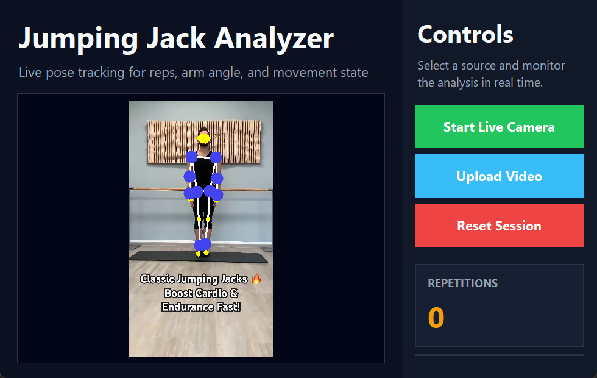

# Jumping Jack Pose Analyzer 🏃‍♂️

> A professional Python desktop app that uses **OpenCV** and **MediaPipe Pose Detection** to analyze jumping jack movement, track exercise state, and count repetitions from a live camera or uploaded video.


## 📸 GUI Screenshot



## ✨ Features

- 🎥 **Live camera mode** for real-time exercise analysis.
- 📁 **Upload video mode** for analyzing saved workout clips.
- 🧠 **MediaPipe pose tracking** with 33 body landmarks.
- 🔢 **Automatic repetition counting** for jumping jacks.
- 📐 **Shoulder angle calculation** to detect up/down movement states.
- 📊 **Professional dashboard UI** with live stats.
- 🔄 **Reset session** button for quick restarts.
- 🖥️ **Desktop application** built with Tkinter.

## 🛠️ Tech Stack

| Technology | Purpose |
| --- | --- |
| Python | Main programming language |
| Tkinter | Desktop GUI |
| OpenCV | Video capture, frame processing, drawing |
| MediaPipe | Pose landmark detection |
| Pillow | Displaying video frames inside Tkinter |

## 📂 Professional Project Structure

```text
jumping-jack-pose-analyzer/
|-- main.py                                # Lightweight app launcher
|-- requirements.txt                       # Python dependencies
|-- README.md                              # Project documentation
|-- assets/
|   |-- models/
|   |   `-- pose_landmarker_lite.task      # MediaPipe pose model
|   `-- videos/
|       `-- sample_jumping_jacks.mp4       # Sample exercise video
|-- docs/
|   `-- images/
|       `-- gui-dashboard.png              # README screenshot
`-- src/
    `-- jumping_jack_analyzer/
        |-- __init__.py
        |-- __main__.py
        |-- app.py                         # Tkinter GUI and app workflow
        `-- pose_detector.py               # Pose detection helper class
```

## 🚀 Getting Started

### 1. Clone the repository

```bash
git clone https://github.com/YOUR-USERNAME/jumping-jack-pose-analyzer.git
cd jumping-jack-pose-analyzer
```

### 2. Create and activate a virtual environment

```bash
python -m venv .venv
```

On Windows:

```bash
.venv\Scripts\activate
```

On macOS/Linux:

```bash
source .venv/bin/activate
```

### 3. Install dependencies

```bash
pip install -r requirements.txt
```

### 4. Run the application

```bash
python main.py
```

## 🎮 How to Use

1. Click **Start Live Camera** to analyze movement from your webcam.
2. Click **Upload Video** to select a workout video from your computer.
3. Watch the dashboard update the repetition count, movement state, and shoulder angle.
4. Click **Reset Session** to clear the current analysis.

## 🧩 How It Works

The app reads each video frame using OpenCV, sends it to MediaPipe for pose landmark detection, then calculates distances and shoulder angles from key body points. A simple movement state machine detects when the user moves from the down position to the up position and back down, then increments the repetition count.

## ✅ Current Detection Logic

- Arms raised and feet apart -> movement state becomes **UP**.
- Arms lowered and feet closer together after an UP state -> one repetition is counted.
- Important landmarks are highlighted on the video feed for visual feedback.

## 📌 Notes

- The file `assets/models/pose_landmarker_lite.task` is required for the newer MediaPipe Tasks API.
- The sample video is stored at `assets/videos/sample_jumping_jacks.mp4`.
- For best results, use a full-body video where shoulders, wrists, hips, and ankles are visible.
- Webcam access must be allowed by your operating system.

## 👨‍💻 Author

Built as a computer vision exercise analysis project using Python, OpenCV, MediaPipe, and Tkinter.
